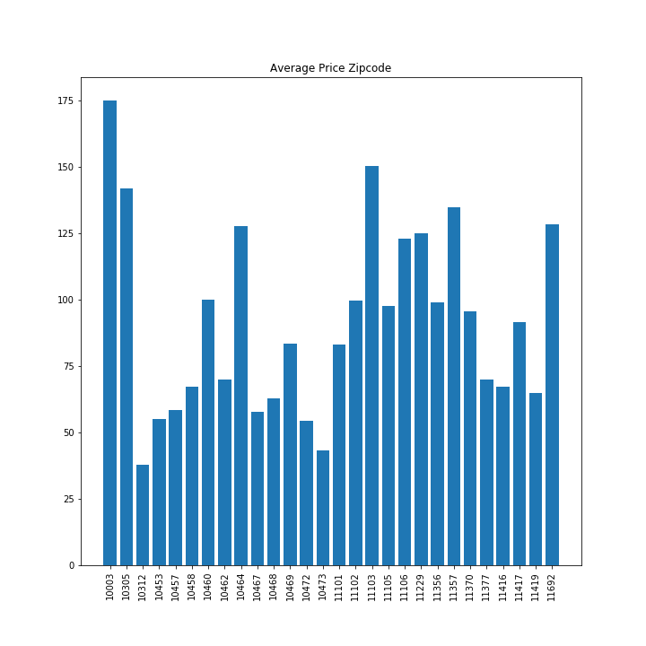

# Data_Bootcamp_Project1
Team: Amy, Jason, and Charles

# Getting Your Bite: Airbnb Properties in NYC
Airbnb is a global network of For Rent by Owner (FRBO) Vacation rentals. This private company has been making waves as one of the fastest growing sectors of the lodging/vacation sector. In 2017 Airbnb earned $2.6B in revenues and they are expecting to top $4B for 2018. As a result, this area has become a hot bed for investors looking to maximize their return in the real estate market and collect a premium on their investment over traditional real-estate property types.

This project used Airbnb data available on Kaggle.com encompassing one year of rental information for New York City from 2017-2018. The data was analyzed with a view towards making decisions on finding the highest revenue potential properties.  

Our process in procuring the data and data cleanup involved identifying the data on Kaggle and downloading the four Airbnb files directly to our computers due to the large file sizes. We began importing the data (16,182,640 lines in the “CalendarData” file).

After reviewing samples of the data lines and eliminating null values in some data sets, we merged the four files into one data frame. We then attempted to identify correlations of data points.

Our initial observations from data clean up showed us that the NYC market is worth $950 million annually over that time frame.  There were 5,582,376 nights rented. The number of active listings during the year was 28,735. We identified the Zip codes with the highest occupancy rates and revenues, as well as borough locations. As this project is skewed towards recruitment data for investors, we identified the super hosts with the highest revenues that may serve as managers for our investor’s properties. 

# Questions
What is the best the best zip code to invest in?

CHART 
CHART

From the data we were able to determine that the best zip codes to invest in are: -
-	11234 - 81% Occupancy, $42,975 average annual revenue per annum
-	11412 - 74% Occupancy, $41693 average annual revenue per annum
-	11434, 72% Occupancy, $43,984 average annual revenue per annum
-	10301, 71% Occupancy, $46,022 average annual revenue per annum

CHART
CHART

Which Boroughs have the most successful investment properties?

CHART

CHART

We isolated two favorable Boroughs to invest in. Specifically, Manhattan and Staten island based upon Average Occupancy and annual average revenue. This information was based on the comparison to the average rental per night in the city and the overall occupancy rate. 

Use the data to define successful investment criteria:
We demonstrated that an average rental revenue of $33,000. Therefore, we demonstrated that successful Airbnb rentals that demonstrated a higher revenue than this number as a successful investment. With a frequency of rental greater than 50%. Our top 5 earning Airbnb hosts earned well over $1 million dollars topping out at $6.4 million for the year

Is there a holiday that is potentially more profitable?
As expected, the Thanksgiving and Christmas holidays are the highest revenue holidays averaging well over $1 million dollars in revenue for the holiday time frame. From an investment standpoint, it suggests that you would want to have your Airbnb rental online and renting by the Thanksgiving season. 

CHART

CHART

Summary
Overall, we feel that the analysis of this data set can serve as an investment profile like Real Estate investment profiles used for rental properties. This data set can allow potential investors to maximize their investment using the meta data available across Airbnb. We believe that this information is just the tip of the iceberg, we should be able to analyze the data further and add more variables like rooms and bathrooms to provide more specificity and information for investors. 

